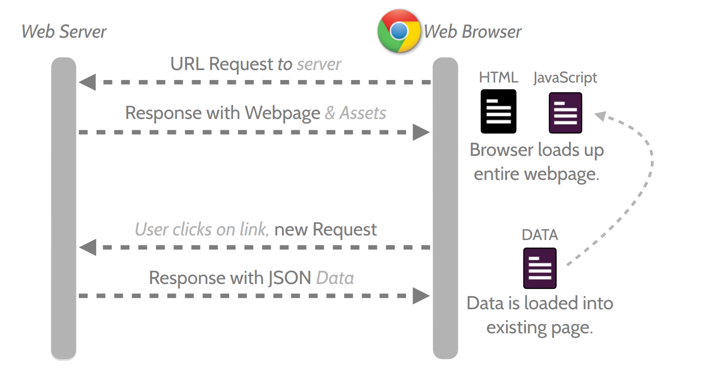

# ANGULAR.JS

Populárny javasript framework pre tvorbu frontendových aplikácií, so zameraním na singlepage aplikácie. 
Aplikácie sú tvorené pomocou HTML kódu a kontrolného kódu javascripte.
Angular.js využíva nové vlastné tagy a atribúty pomocou, ktorých prepája html s javascriptom.
Taktiež môžeme pridávať výrazy do aplikácií.

```html
<p>Výsledok výpočtu {{ 10 + 5 }}</p>
```

## SinglePage aplikácia

Je aplikácia, ktorá sa načíta pri prvom spustení a následne sa už len obnovuje jej obsah. 
Výhodou je rýchlejšie načítavanie "bez prebliknutí", ale aj minimalizácia prenášaných dát medzi serverom a klientom.



## Two way Data binding


## Prvky angularu

### Module

```js
var app = angular.module('menoModulu', ['ui.datepicker']);
```

Angular aplikácie sa skladajú z modulov, moduly môžu požadovať ako závislosť iné moduly.

Napr. V aplikácii chceme používať prvok kalendára. Existuje modul ui.datepicker, ktorý túto funkcionalitu podporuje. 
Nastavíme ho ako závislosť a už môžeme využívať prvky tohto modulu v našom vytvorenom module.

### Controller

```js
app.controller('NameOfController', ['$scope', '$http', function($scope, $http) {
  $scope.model = {
    meno: 'Patrik'
  };
}]);
```

Javascriptová časť html elementu. Vyššie uvedený príkaz ukazuje registráciu controlera v angular module `menoModulu`.
`$scope` a `$http` predstavujú nami zvolené závislosti, ktoré chceme využívať pri programovaní obslužného kódu pre html.

### View

```html
<html ng-app="menoModulu">
<head>
  <script src="angular.min.js"></script>
  <script src="app.js"></script>
</head>
<body ng-controller="NameOfController">
  <p><label>Meno: <input type="text" ng-model="model.meno" /></label></p>
  <p>Hello {{model.meno}}!</p>
</body>
</html>
```

HTML kód prislúchajúci modulu `menoModulu` a používajúci 1 controller `NameOfController`. 
Tento kód ukazuje funkčnosť two way data binding, ktorý automaticky upravuje obsah stránky počas upravovania textu v `<input>`

### Directívy Tagy

V predchádzajúcom príklade s môžeme všimnúť atribút `ng-model`, ktorý nepatrí do špecifikácie HTML5. Angularom vieme pridávať aj tagy do html, tieto tagy angular pri inicializácií hľadá a vykonná atribútu/elemntu príslušný kód. Takýmto spôsobom vieme vytvoriť elementy pre datepicker, timepicker, select, menu, html, ...

```js
app.directive('myCustomer', function() {
  return {
    template: 'Name: {{customer.name}} Address: {{customer.address}}'
  };
})
```

## Čo potrebujem pre programovanie v angulare?

### Angular.js

Framework je open source a ten môžeme stiahnuť zo stránky https://angularjs.org/ alebo pomocou balíčkového manažéra pre javascript
```sh
npm install angular
```

### Textový editor

Odporúčam použiť editor [WebStorm](https://www.jetbrains.com/webstorm/) ([Študentská licencia](https://www.jetbrains.com/student/)), ale stačí aj použitie editora Notepad. Aby sme nemuseli nič inštalovať, využijeme webový editor [Plunker](https://plnkr.co/)

### Webový prehliadač

## Spoločný projekt - komentáre produktov

Vytvorme komentovaciu stránku, zadáme meno a komentár a po kliknutí na uloziť sa pridá komentár do zoznamu a vyprázdni sa formulár.

```html
<!DOCTYPE html>
<html>

<head>
  <link data-require="bootstrap@3.3.7" data-semver="3.3.7" rel="stylesheet" href="https://maxcdn.bootstrapcdn.com/bootstrap/3.3.7/css/bootstrap.min.css" />
  <script data-require="bootstrap@3.3.7" data-semver="3.3.7" src="https://maxcdn.bootstrapcdn.com/bootstrap/3.3.7/js/bootstrap.min.js"></script>
  <script data-require="angularjs@1.5.8" data-semver="1.5.8" src="https://opensource.keycdn.com/angularjs/1.5.8/angular.min.js"></script>
</head>

<body>
  <div class="container">
    <h1>SPS1 Komentáre</h1>

    <!-- výpis komentárov -->

    <hr>

    <form>
      <div class="form-group">
        <label>Meno</label>
        <input type="text" class="form-control" />
      </div>
      <div class="form-group">
        <label>Komentár</label>
        <textarea class="form-control"></textarea>
      </div>
      
      <button type="submit" class="btn btn-primary">Odošli</button>
      <button type="reset" class="btn btn-warning">Resetuj</button>
    </form>
  </div>
</body>

</html>
```

### Úloha ć. 1 - Nový parameter

Upravte komentovaciu stránku tak aby podporovala na vstupe aj e-mailovú adresu.

### Úloha č. 2 - Vlastný projekt

Navrhnite model (napr. Študent) s aspoň tromi entitami (napr. Meno, Projekt, Hodnotenie). Ku tomuto modelu vytvorte stránku podobne ako to bolo v spoločnom projekte. Váš projekt musí spĺňať následovné body

* Meno modulu je **Uloha2**
* Meno kontrolera je **KontrolerPriezvisko**
* Zobrazenie všetkych záznamov zobraziť v [tabuľke](http://getbootstrap.com/css/#tables)

## Ďalšie zdroje

* Angular API Docs https://docs.angularjs.org/api
* Angular couse https://www.codeschool.com/pages/angular-1-vs-2
